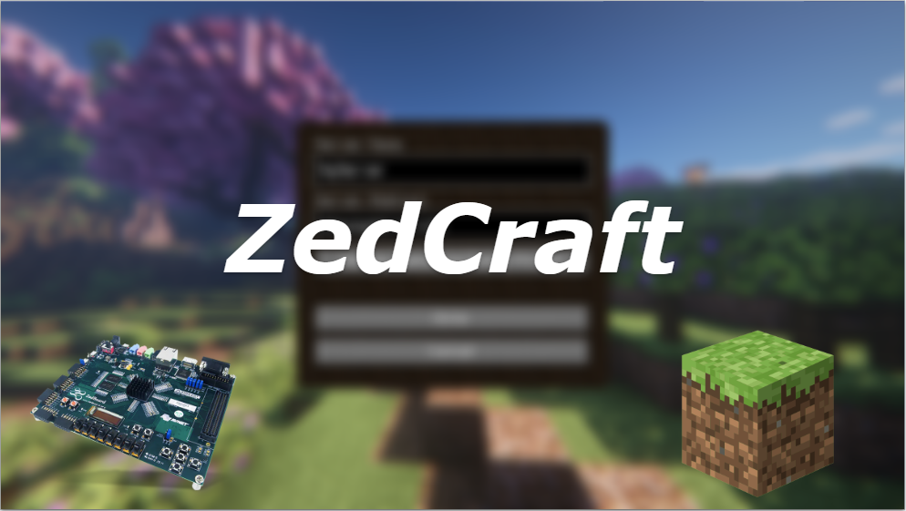

# ZedCraft



## Overview

ZedCraft is a project developed as part of CPRE 488, also known as "Embedded Systems Design," where we aim to run a Minecraft server on a ZedBoard FPGA. The project integrates various peripherals, including a camera and a turret available to us from our CPRE 488 lab materials, to enable interaction with the Minecraft environment through plugins and C programs.

## Features

- Run a Minecraft server on a ZedBoard FPGA.
- Integrate a camera for in-game visuals.
- Connect a turret for interactive gameplay.
- Develop Minecraft plugins and C programs for peripheral interaction.
- Explore the possibilities of embedded systems in gaming environments.

## Getting Started

### Prerequisites

- [ZedBoard FPGA](https://digilent.com/shop/zedboard-zynq-7000-arm-fpga-soc-development-board/)
- [Minecraft Server - Spigot 1.8 API Documentation](https://helpch.at/docs/1.8/)
- [(CPRE 488 MP-2): Camera module lab](https://class.ece.iastate.edu/cpre488/labs/MP-2.pdf)
- [(CPRE 488 MP-2): Camera module materials](https://class.ece.iastate.edu/cpre488/labs/MP-2.zip)
- [(CPRE 488 MP-3): Turret hardware lab](https://class.ece.iastate.edu/cpre488/labs/MP-3.pdf)
- [(CPRE 488 MP-3): Turret hardware materials](https://class.ece.iastate.edu/cpre488/labs/MP-3.zip)

### Installation

1. Clone the repository:

   ```bash
   git clone https://github.com/your_username/ZedCraft.git
   ```

2. Follow the setup instructions in the [documentation](docs/setup.md).

## Usage

1. Start the Minecraft server on the ZedBoard FPGA.
2. Connect to the server from your Minecraft client.
3. Interact with the game using the camera and turret peripherals.

## Acknowledgements

- Special thanks to our instructor, TAs, and classmates for their support and feedback.
- Hat tip to [Minecraft](https://www.minecraft.net/) for inspiring this project.
